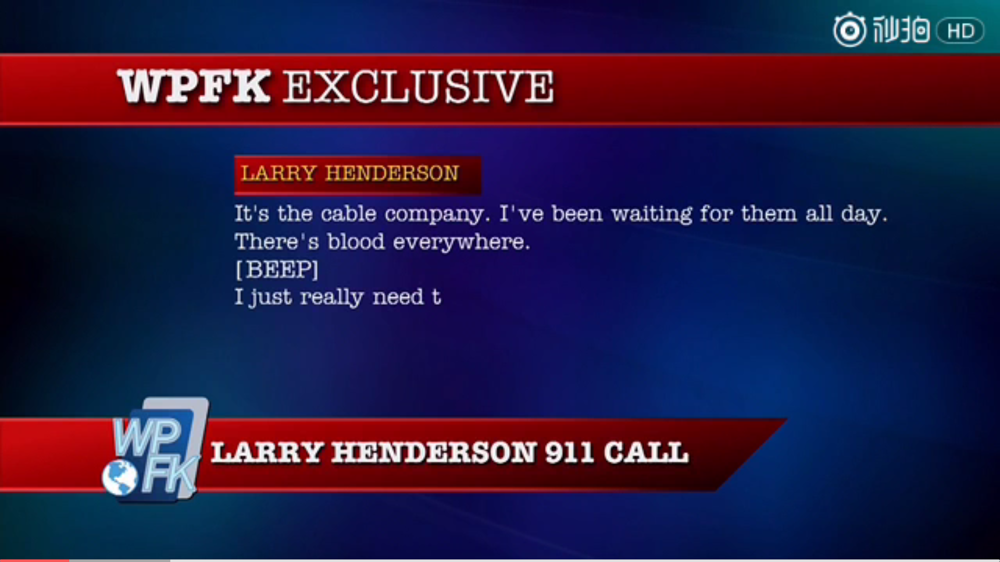

# VideoPlayer

VideoPlayer is an media player for Android base on ijkplayer.

##Screenshot##

   
 
  
	
##Usage##

 **step1**    

	将库导入到项目中 build 

		dependencies {
		compile fileTree(dir: 'libs', include: ['*.jar'])
		testCompile 'junit:junit:4.12'
		compile 'com.android.support:appcompat-v7:24.1.0'
		compile project(":videoplayer")
		}
	
	setting.gradle

		include ':videoplayer'
**step2**
	 
1. Androidmanifest.xml  

		  <application
		        android:name=".VIdeoApplication"
		        android:allowBackup="true"
		        android:icon="@mipmap/ic_launcher"
		        android:label="@string/app_name"
		        android:supportsRtl="true"
		        android:theme="@style/AppTheme">
		        <activity android:name=".MainActivity"
		            android:configChanges="keyboardHidden|orientation|screenSize"
		            android:screenOrientation="sensor"
		            android:theme="@style/Theme.AppCompat.NoActionBar"
		            >
		            <intent-filter>
		                <action android:name="android.intent.action.MAIN" />
		
		                <category android:name="android.intent.category.LAUNCHER" />
		            </intent-filter>
		        </activity>
		        <activity android:name=".list.ListViewActivity"/>
		    </application>
		
		public class VIdeoApplication extends Application {
		    @Override
		    public void onCreate() {
		        super.onCreate();
		        PlayerApplication.initApp(this);
		    }
		}

2. 布局  

	    <com.github.jinsedeyuzhou.VPlayPlayer
	        android:id="@+id/fl_content"
	        android:layout_width="match_parent"
	        android:layout_height="210dp"/>
3. MainActivity.java

		  private String url = "http://gslb.miaopai.com/stream/4YUE0MlhLclpX3HIeA273g__.mp4?yx=&refer=weibo_app";
		    private VPlayPlayer vp;
		    private DragScaleView dragview;
		
		
		    @Override
		    protected void onCreate(Bundle savedInstanceState) {
		        super.onCreate(savedInstanceState);
		        setContentView(R.layout.activity_main);
		        vp = (VPlayPlayer) findViewById(R.id.fl_content);
		        dragview = (DragScaleView) findViewById(R.id.dragview);
		        vp.setShowNavIcon(true);
		        vp.setTitle(url);
		        vp.play(url);
		    };
4. 配置生命周期方法,为了让播放器同步Activity生命周期

	    @Override
	    public boolean onKeyDown(int keyCode, KeyEvent event) {
	        if (vp!=null&& vp.handleVolumeKey(keyCode))
	            return true;
	        return super.onKeyDown(keyCode, event);
	    }
	
	
	    @Override
	    public void onBackPressed() {
	        if (vp.onBackPressed())
	            return ;
	        super.onBackPressed();
	    }
	
	    @Override
	    public void onConfigurationChanged(Configuration newConfig) {
	        super.onConfigurationChanged(newConfig);
	        if (vp != null)
	            vp.onChanged(newConfig);
	    }
	
	    @Override
	    protected void onResume() {
	        super.onResume();
	        if (vp != null)
	            vp.onResume();
	    }
	
	    @Override
	    protected void onPause() {
	        super.onPause();
	        if (vp != null)
	            vp.onPause();
	
	    }
	
	    @Override
	    protected void onDestroy() {
	        super.onDestroy();
	        if (vp != null) {
	            vp.onDestory();
	            vp=null;
	        }
	       
	    }

##Proguard

根据你的混淆器配置和使用，您可能需要在你的 proguard 文件内配置以下内容：

		-keep com.dou361.ijkplayer.** {
		*;
		-dontwarn com.dou361.ijkplayer.**;
		}

##Thanks
[GSYVideoPlayer](https://github.com/CarGuo/GSYVideoPlayer)  
[ijkplayer](https://github.com/Bilibili/ijkplayer)  
[GiraffePlayer](https://github.com/tcking/GiraffePlayer) 
[IjkPlayerView](https://github.com/Rukey7/IjkPlayerView) 
and so and
##ISSUE
**FFMPEG bug：**  
1. IJKPLAY有一个问题，有人已经提过，不过目前还未解决，就是某些短小的视频会无法seekTo，说是FFMEPG的问题  
2. 快进到某个位置会回退几个关键帧。

##About Author

##License

**Copyright (C) dou361, The Framework Open Source Project**

Licensed under the Apache License, Version 2.0 (the "License");
you may not use this file except in compliance with the License.
You may obtain a copy of the License at

    http://www.apache.org/licenses/LICENSE-2.0

Unless required by applicable law or agreed to in writing, software
distributed under the License is distributed on an "AS IS" BASIS,
WITHOUT WARRANTIES OR CONDITIONS OF ANY KIND, either express or implied.
See the License for the specific language governing permissions and
limitations under the License.

(Frequently Asked Questions)FAQ
##Bugs Report and Help

If you find any bug when using project, please report here. Thanks for helping us building a better one.
